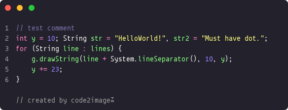

# Code2Image

A Java library that converts code snippets to beautiful, syntax-highlighted images. Perfect for sharing code on social media, presentations, or documentation.



## Features

- Convert code to high-quality images with syntax highlighting
- Multiple themes (17 different color schemes)
- Multiple fonts (17 different monospaced fonts)
- Customizable settings:
  - Font size and style
  - Margins and padding
  - Window styling (rounded corners, window buttons)
  - Line numbers
  - "Created by" watermark
- Supports PNG image format
- Uses JFlex for lexical analysis and syntax highlighting

## Installation

### Prerequisites

- Java 16 or higher
- Maven

### Building from Source

1. Clone the repository
2. Build with Maven:

```bash
mvn clean install
```

## Usage

### Basic Example

```java
// Create settings with default values
Code2ImageSettingsBuilder settingsBuilder = new Code2ImageSettingsBuilder();
Code2ImageSettings settings = settingsBuilder.build();

// Create converter with settings
Code2Image converter = new Code2Image(settings);

// Convert a file to an image
converter.convertAndSave("path/to/sourcecode.java", "output.png");
```

### Customized Example

```java
// Create settings with custom values
Code2ImageSettingsBuilder settingsBuilder = new Code2ImageSettingsBuilder();
Code2ImageSettings settings = settingsBuilder
        .setFont(Fonts.customFont("Sudo", Font.PLAIN, 18))
        .setMargin(10)
        .setRectangleArc(15)
        .setButtonRadius(12)
        .setDrawLineNumbers(true)
        .setDrawCreatedByText(true)
        .setTheme(Themes.DRACULA)
        .setFormat(ImageFormat.PNG)
        .build();

// Create converter with settings
Code2Image converter = new Code2Image(settings);

// Convert a file to an image
converter.convertAndSave("path/to/sourcecode.java", "output.png");
```

## Available Themes

The library includes 17 popular syntax highlighting themes:

- A11yDark
- Base16Dark
- Base16Light
- Blackboard
- Dracula
- Lucario
- Material
- Monokai
- Nord
- OceanicNext
- OneDark (default)
- OneLight
- Panda
- Seti
- Twilight
- Verminal
- VSCode

## Available Fonts

The library includes 17 popular monospaced fonts:

- Default (Java's built-in monospaced font)
- Anonymous Pro
- Cousine
- DejaVu Sans Mono
- Droid Sans Mono
- Fira Code
- Fira Mono
- Hack
- IBM Plex Mono
- Inconsolata
- JetBrains Mono NL
- Oxygen Mono
- PT Mono
- Roboto Mono
- Source Code Pro
- Space Mono
- Sudo
- Ubuntu Mono

## How JFlex is Used

This project uses JFlex for lexical analysis of source code. JFlex is a lexical analyzer generator for Java that converts regular expressions and actions into a deterministic finite automaton.

The process works as follows:

1. JFlex definition files (*.flex) define the lexical rules for different programming languages
2. The JFlex Maven plugin generates Java lexer classes during the build process
3. These lexers tokenize the source code into different token types (keywords, identifiers, literals, etc.)
4. The tokens are then rendered with appropriate colors based on the selected theme

The project currently includes a lexer for Java, with plans to add support for more languages in the future.

## Planned Features

- Support for more programming languages
- Font style customization based on token type (e.g., italic comments)
- Window button positioning options
- Window border and drop shadow
- Image watermark
- Image backgrounds
- REST API endpoint

## License

This project is licensed under the MIT License—see the [LICENSE](LICENSE) file for details.
